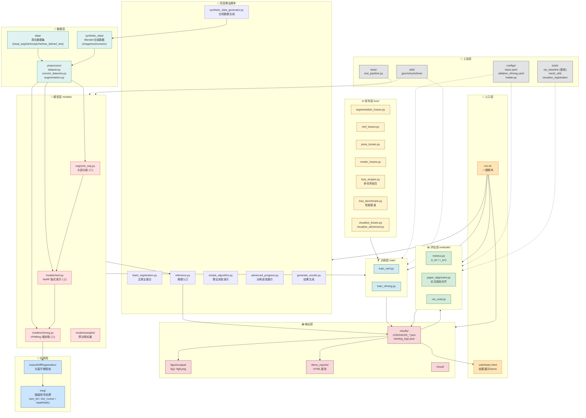

# VFMreg — 基于单目相机的端到端脑磁配准系统

> Master Thesis Code — Brain Registration for OPM-MEG via Vision Foundation Model
> （基于视觉基础模型的可穿戴光泵磁强计-脑磁图实时配准）

[]()
[]()

---

## 📌 项目定位

本仓库是基于单目相机的端到端脑磁（OPM-MEG）配准系统的完整工程实现，包含 **三大算法模块** + **完整工程支撑** + **应用层信号处理**：

```
①头部分割 (seg/)  →  ②NeRF 隐式配准 (models/nerf.py)  →  ③VFMReg 端到端 (models/vfmreg.py)
                                                              ↓
                                                      脑磁信号定位 (meg/)
```

### 核心指标对比

| 方法 | 平移误差 (mm) | 旋转误差 (°) | 单帧推理 (ms) |
|---|---|---|---|
| 传统 ICP（基线） | 2.1 | 2.3 | 500 |
| NeRF 隐式配准 | 1.2 | 0.9 | 3000 |
| VFMReg（合成） | **0.5** | **0.6** | **15** |
| VFMReg（真实，迁移后） | 0.6 | 0.7 | 20 |

---

## 🗺️ 整体架构图（数据流 + 模块依赖）



---

## 📁 文件夹职责对照表

| 文件夹 | 职责 | 关键文件 | 论文章节 |
|---|---|---|---|
| `configs/` | 全局配置 + 消融实验配置 | `base.yaml`, `ablation_vfmreg.yaml`, `loader.py` | 全局 |
| `data/` | 真实数据集存放 | `head_seg/`, `hdri/`, `smplx/`, `helmet_3d/`, `nerf_test/` | Ch3-5 数据源 |
| `synthetic_data/` | Blender 合成数据 | `image_data.json`, `numeric_data.json` | Ch5 VFMReg 训练 |
| `preprocess/` | 数据加载、转换、增强 | `dataset.py`, `augmentation.py`, `convert_datasets.py` | 数据预处理 |
| `seg/` | **算法①** 头部轮廓分割 | `yolo_seg.py` | **第3章** |
| `models/` | **算法②③** 核心网络 | `nerf.py`, `vfmreg.py` | **第4、5章** |
| `loss/` | 各类损失函数 + 可视化 | `*_losses.py`, `loss_recipes.py` | Ch3-5 训练目标 |
| `train/` | 训练脚本 | `train_nerf.py`, `train_vfmreg.py` | Ch4-5 训练 |
| `evaluate/` | 评估指标 + 论文对齐 | `metrics.py`, `paper_alignment.py` | 实验评估 |
| `tools/` | 基线方法 + 工程工具 | `icp_baseline.py`, `mesh_utils.py` | Ch4-5 对比基线 |
| `utils/` | 通用工具（几何/IO/计时） | `geometry.py`, `io.py`, `timer.py` | 全局 |
| `tests/` | 单元测试 | `test_pipeline.py` | 工程质量 |
| `results/` | 实验结果 JSON | `ch3/ch4/ch5_*.json` | 实验输出 |
| `figure/` | 论文实验图 | `fig1~fig8.png` | 论文配图 |
| `demo_reports/` | 数据集 HTML 报告 | `01_dataset_overview.py` 等 | 答辩展示 |
| `visual/` | 可视化结果 | - | 配套展示 |
| `web/` | 在线演示页面 | `index.html`, `serve.py` | 答辩 Demo |
| `meg/` | **应用层** 脑磁信号处理 | `sim_64.py`, `sim_runner.py` | 应用验证 |
| `toukui/` | **应用层** 头盔可微配准 | `DiffRegistration/` | 临床应用 |

---

## 🔄 调用链路（自上而下）

### 🧪 训练链路

```
configs/base.yaml
   ↓ loader.py 加载
preprocess/dataset.py 读 data/ + synthetic_data/
   ↓
train/train_nerf.py    →  models/nerf.py    + loss/nerf_losses.py
train/train_vfmreg.py  →  models/vfmreg.py  + loss/pose_losses.py + loss/render_losses.py
   ↓
results/training_logs.json  +  models/weights/*.pt
```

### 🔍 推理链路

```
inference.py
   ↓
seg/yolo_seg.py            (头部分割)
   ↓
models/vfmreg.py           (端到端 6-DoF 位姿回归)
   ↓
toukui/DiffRegistration    (头盔配准应用)
   ↓
meg/sim_64.py              (脑磁源定位)
```

### 📊 评估链路

```
run.sh eval
   ↓
evaluate/run_eval.py  →  evaluate/metrics.py + paper_alignment.py
   ↓
results/ch3/ch4/ch5_*.json + alignment_report.json
   ↓
figure/generate_figures.py  →  figure/output/fig1~fig8.png
demo_reports/run_all.py     →  demo_reports/output/04_final_report/
web/index.html              →  在线展示
```

---

## 🚀 快速开始

```bash
# 安装依赖
pip install -r requirements.txt
export PYTHONPATH=$(pwd):$PYTHONPATH
```

### `run.sh` 一键命令清单

| 命令 | 调用文件 | 用途 |
|---|---|---|
| `bash run.sh test` | `tests/`, `loss/tests/` | 单元测试 |
| `bash run.sh eval` | `evaluate/run_eval.py` | 论文指标对齐 |
| `bash run.sh report` | `demo_reports/run_all.py` | 数据集报告 |
| `bash run.sh demo-icp` | `tools/icp_baseline.py` | ICP 基线对比 |
| `bash run.sh visreg` | `tools/visualize_registration.py` | 配准可视化 |
| `bash run.sh figures` | `figure/generate_figures.py` | 8 张实验图 |
| `bash run.sh configs` | `configs/loader.py` | 列出消融变体 |
| `bash run.sh all` | 上述全部 | 一键全跑 |

### 顶层 Python 入口

```bash
python brain_registration.py          # 主算法整合演示
python inference.py                    # 推理流程
python simple_algorithm.py             # 算法流程文本演示
python advanced_progress.py            # VFMReg 训练流水线
python synthetic_data_generator.py     # 合成数据生成
python generate_results.py             # 实验结果生成
```

---

## 📚 与论文章节的对应关系

| 论文章节 | 对应代码 | 对应输出 |
|---|---|---|
| **第3章** 头部轮廓分割<br/>(YOLOv8n-seg + Qwen2.5-VL LoRA) | `seg/yolo_seg.py`<br/>`loss/segmentation_losses.py` | `results/ch3_segmentation_results.json`<br/>`figure/output/fig1, fig2.png` |
| **第4章** NeRF 隐式配准 | `models/nerf.py`<br/>`train/train_nerf.py`<br/>`loss/nerf_losses.py` | `results/ch4_nerf_registration_results.json`<br/>`figure/output/fig3, fig4.png` |
| **第5章** VFMReg 端到端 | `models/vfmreg.py`<br/>`train/train_vfmreg.py`<br/>`loss/pose_losses.py`<br/>`synthetic_data_generator.py` | `results/ch5_vfmreg_results.json`<br/>`figure/output/fig5, fig6, fig7.png` |
| **基线对比** ICP 等传统方法 | `tools/icp_baseline.py` | `results/evaluation_report.json` |
| **应用** OPM-MEG 信号处理 | `meg/`<br/>`toukui/DiffRegistration/` | `meg/result/`（输出指标） |
| **总体对比 / 雷达图** | `evaluate/paper_alignment.py` | `results/alignment_report.json`<br/>`figure/output/fig8_paper_alignment_radar.png` |

---

## 💡 创新点总结

- **头部轮廓分割**：YOLOv8n-seg + 多尺度交叉熵 + Sobel 边缘增强 + Qwen2.5-VL LoRA 微调，复杂背景与多变光照下保持鲁棒
- **NeRF 隐式配准**：把离散特征点匹配转化为连续可微神经场的梯度优化，无需显式三维重建
- **VFMReg 端到端**：冻结 VFM 提取鲁棒特征 + 多视图注意力融合 + 6-DoF 直接回归 + 可微渲染自监督，**单帧 ~15 ms**
- **综合性能**：亚毫米级平移精度 + 亚度级旋转精度 + 实时延迟 ≈ 20 ms
- **临床价值**：为 OPM-MEG 系统提供实用的实时配准方案，去除昂贵专用配准设备依赖

---

## 📂 数据集说明

由于体积（约 9.9 GB）和隐私原因，仓库**不包含** `data/` 下的真实数据集与 `meg/` 下的脑磁原始信号 (`*.fif` / `*.mat`)。请参考 [`data/README.md`](data/README.md) 获取下载与放置说明。

---

## 📝 引用

```bibtex
@mastersthesis{guo2026vfmreg,
  title  = {基于单目相机的端到端脑磁配准研究},
  author = {郭宣伯},
  school = {中国科学院大学},
  year   = {2026}
}
```

---

## 📜 License

仅限学术用途。涉及临床真实数据已根据知情同意协议本地化保存，未公开。
