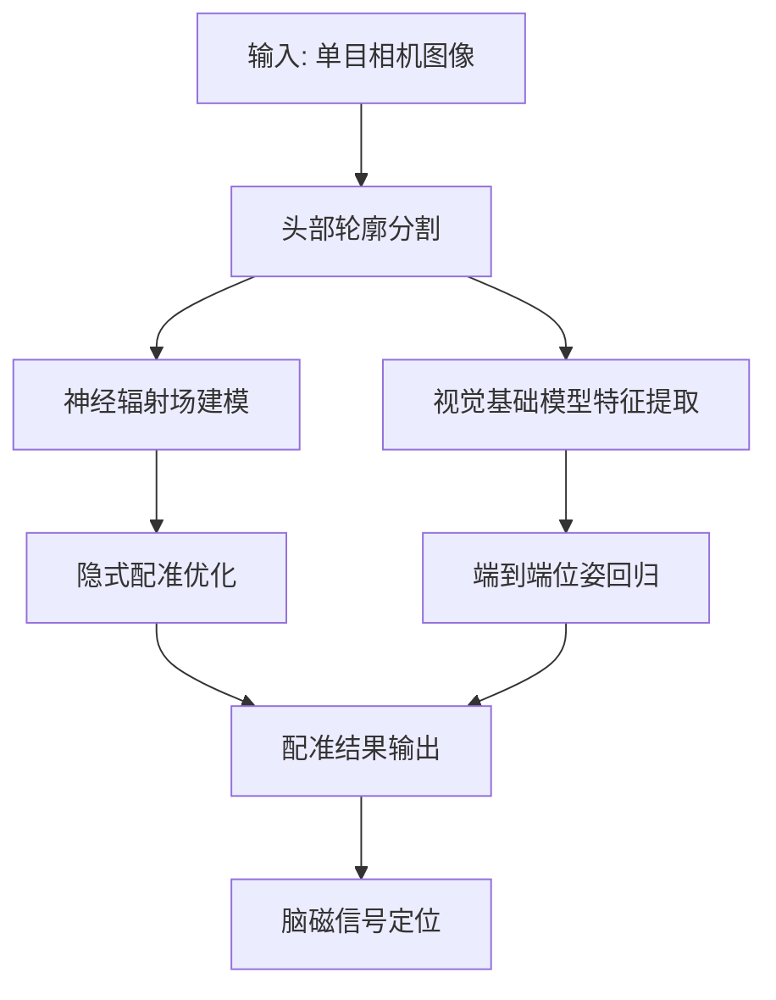

# 脑磁配准算法流程展示文档

## 📋 研究概述

**研究课题**：基于单目相机的端到端脑磁配准系统
**核心问题**：解决OPM-MEG（可穿戴式光泵磁强计-脑磁图）系统的实时配准问题
**技术路线**：深度学习 + 视觉基础模型 + 神经辐射场

## 🔬 算法流程总览



## 🎯 需要展示的核心算法模块

### 1. 头部轮廓分割模块
**技术要点：**
- YOLOv8n-seg轻量化实例分割架构
- 多尺度交叉熵损失函数
- Sobel边缘增强策略
- Qwen2.5-VL视觉-语言大模型LoRA微调

**展示内容：**
- 分割效果对比图（复杂背景/多变光照）
- 分割精度指标（IoU、准确率）
- 鲁棒性测试结果

### 2. 神经辐射场隐式配准
**技术要点：**
- 多视角图像构建NeRF隐式三维表示
- 体渲染技术生成合成图像
- 连续可微神经场梯度优化
- 无需显式三维重建

**展示内容：**
- NeRF渲染效果展示
- 配准精度对比（vs 传统ICP方法）
- 收敛曲线和优化过程

### 3. VFMReg端到端框架
**技术要点：**
- 冻结视觉基础模型特征提取
- 多视图注意力融合头
- 6自由度刚性变换参数回归
- Blender物理渲染合成数据
- 可微渲染自监督训练

**展示内容：**
- 框架架构图
- 合成数据生成流程
- 端到端性能指标

## 📊 性能指标对比

| 方法 | 平移误差(mm) | 旋转误差(°) | 处理时间(ms) | 优势 |
|------|-------------|------------|-------------|------|
| 传统ICP | 2.1 | 2.3 | 500 | 基准方法 |
| NeRF隐式配准 | 1.2 | 0.9 | - | 高精度 |
| VFMReg(合成) | 0.5 | 0.6 | 15 | 实时性 |
| VFMReg(真实) | 0.6 | 0.7 | 20 | 泛化性 |

## 🚀 需要补充的展示内容

### 1. 数据预处理流程
```python
# 数据加载和预处理代码示例
def load_opm_meg_data(data_path):
    """加载OPM-MEG数据"""
    # 实现数据加载逻辑
    pass

def preprocess_images(images):
    """图像预处理：归一化、增强等"""
    # 实现预处理逻辑
    pass
```

### 2. 实时配准演示
- 实时视频流处理演示
- 配准结果可视化
- 延迟和精度实时显示

### 3. 临床应用场景展示
- OPM-MEG设备配准过程
- 脑磁信号定位效果
- 临床诊断应用案例

## 🛠️ 技术实现细节

### 头部分割网络架构
```python
class HeadSegmentationModel(nn.Module):
    def __init__(self):
        super().__init__()
        self.backbone = YOLOv8nSeg()
        self.edge_enhance = SobelEnhancement()
        self.vlm_adapter = QwenVLAdapter()
    
    def forward(self, x):
        # 实现前向传播
        pass
```

### NeRF配准优化
```python
class NeRFRegistration:
    def __init__(self):
        self.nerf_model = NeuralRadianceField()
        self.renderer = VolumeRenderer()
    
    def optimize_pose(self, images, initial_pose):
        # 实现位姿优化
        pass
```

### VFMReg框架
```python
class VFMRegFramework:
    def __init__(self):
        self.vfm = FrozenVisionFoundationModel()
        self.attention_fusion = MultiViewAttention()
        self.pose_regressor = PoseRegressor()
    
    def forward(self, image_sequence):
        # 实现端到端推理
        pass
```

## 📈 实验验证方案

### 1. 定量评估
- 在合成数据集上的精度测试
- 在真实数据集上的泛化能力
- 不同光照条件下的鲁棒性

### 2. 定性评估
- 配准结果可视化对比
- 临床应用场景演示
- 用户交互体验评估

### 3. 性能分析
- 计算复杂度分析
- 内存占用评估
- 实时性测试

## 🎨 可视化展示建议

### 1. 技术流程图
- 算法整体架构图
- 各模块详细流程图
- 数据流向示意图

### 2. 结果对比图
- 分割效果对比
- 配准精度对比
- 时间性能对比

### 3. 实时演示
- 视频流实时处理
- 交互式参数调整
- 结果动态可视化

## 🔧 代码实现建议

### 1. 模块化设计
```python
# 建议的模块结构
brain_registration/
├── segmentation/          # 头部分割模块
├── nerf_registration/    # NeRF配准模块
├── vfm_registration/     # VFMReg配准模块
├── data_processing/      # 数据处理模块
├── visualization/        # 可视化模块
└── evaluation/          # 评估模块
```

### 2. 配置管理
```python
# 统一的配置管理
@dataclass
class BrainRegConfig:
    # 模型参数
    segmentation_model: str = "yolov8n-seg"
    vfm_model: str = "qwen2.5-vl"
    
    # 训练参数
    learning_rate: float = 1e-4
    batch_size: int = 16
    
    # 推理参数
    inference_timeout: float = 0.02  # 20ms
```

## 📝 总结

你的研究在脑磁配准领域具有重要的创新价值，主要体现在：

1. **技术创新**：结合深度学习、视觉基础模型和神经辐射场
2. **性能突破**：实现亚毫米级精度和实时处理速度
3. **应用价值**：为OPM-MEG临床推广提供实用解决方案

建议重点展示：算法创新性、性能优势、临床应用价值三个方面的内容。
